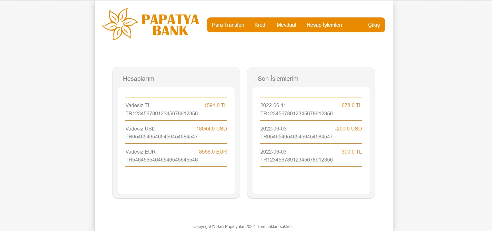
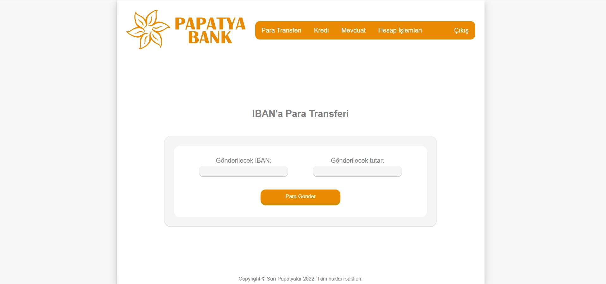
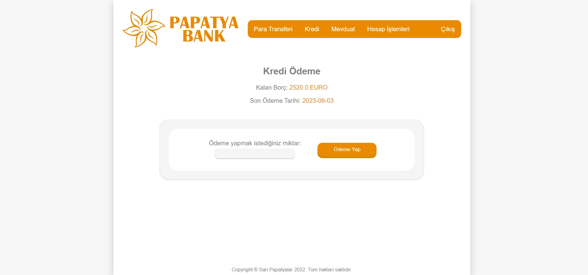
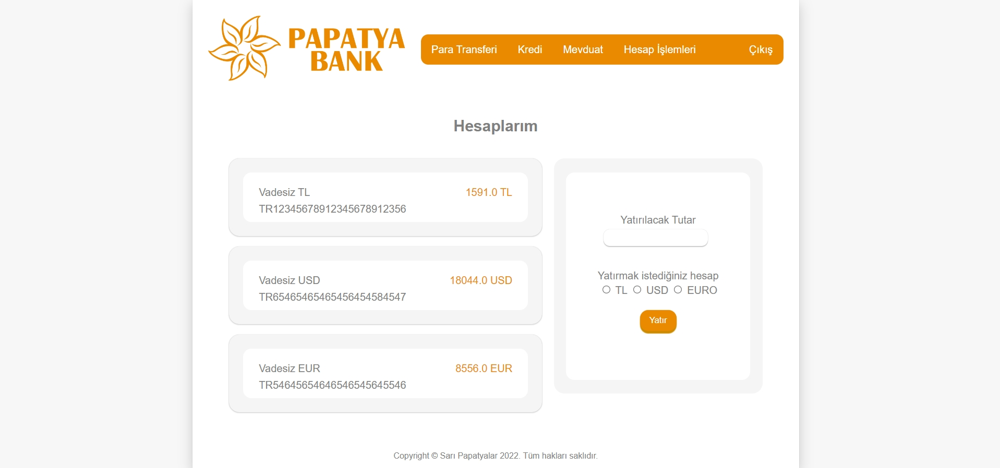

# Papatya Bank
Unfortunately, we use JSF and Glassfish (Netbeans 8.2), which is an old technology, in the Programming Application lesson. This project was our project assignment. So we had to :D However, we wanted to do the best we could. And here you are **Papatya Bank**!

| Side | Technology  |
| ---- | ----- |
| Backend | JSF |
| Frontend | CSS and XHTML |
| Database | JavaDB |

